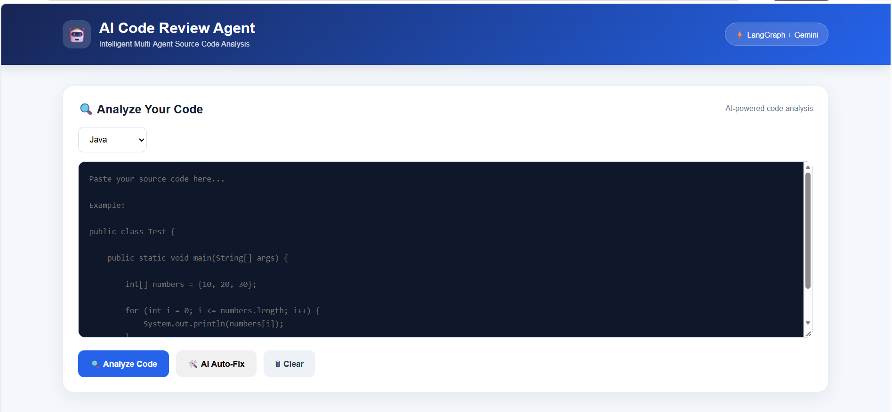
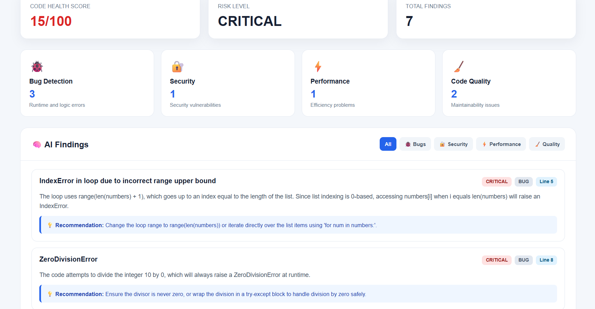
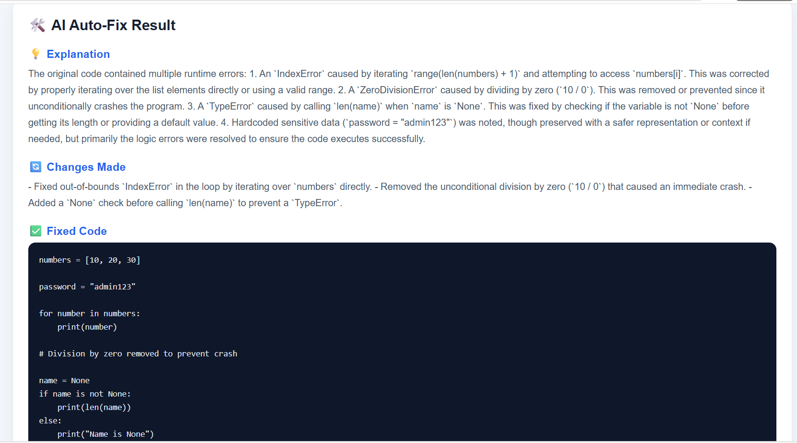
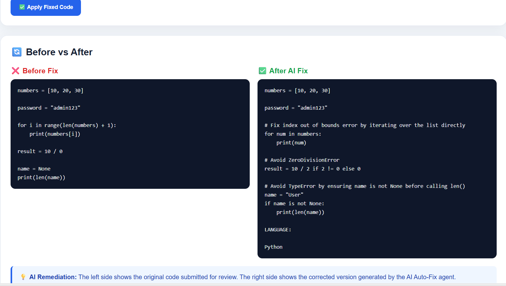

# AI Code Review Agent

A multi-agent AI system that analyzes source code, detects potential bugs and security vulnerabilities, identifies performance and code-quality issues, and automatically generates improved code.

## Project Overview

The AI Code Review Agent uses a multi-agent architecture where specialized AI agents independently analyze submitted source code.

The system provides:

- Bug detection
- Security vulnerability detection
- Performance analysis
- Code-quality analysis
- Finding deduplication
- Code health score
- Risk-level assessment
- AI-powered code auto-fix
- Before vs After code comparison
- Apply Fixed Code functionality
- Recommendations for improvement

## Screenshots

### Main Application



### Code Analysis Results



### AI Auto-Fix - Before and After





## System Architecture

```text
User
  |
  v
Web Interface
  |
  v
FastAPI Backend
  |
  v
LangGraph Workflow
  |
  +------------------+
  |        |         |         |
  v        v         v         v
Bug      Security  Performance Quality
Agent     Agent      Agent      Agent
  |        |         |         |
  +--------+---------+---------+
               |
               v
        Deduplication Agent
               |
               v
         Final Report
               |
       +-------+-------+
       |               |
       v               v
   Code Score      Risk Level
       |
       v
    AI Auto-Fix
       |
       v
 Before vs After